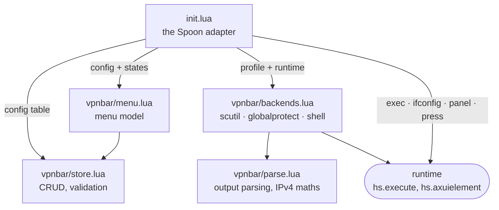

# Architecture

Four modules decide things and one file talks to Hammerspoon.



`store`, `menu`, `parse` and `backends` never call Hammerspoon. `backends` is
handed a **runtime** — four functions — and asks it for everything, which is
how a test drives the real decision code with a table of canned answers. See
[ADR 0002](adr/0002-a-pure-core-and-a-thin-shell.md).

```lua
runtime.exec(command)      --> stdout, ok
runtime.ifconfig()         --> stdout                (cached per refresh)
runtime.panel(app)         --> state                 (opens a panel; on demand only)
runtime.press(app, verbs)  --> ok, err               (clicks a control in a panel)
```

## One refresh

1. The timer fires, or the menu is opened, or **Refresh now** is clicked.
2. `obj:runtime(allowPanelReads)` is built. On the timer, `allowPanelReads` is
   false and `runtime.panel` answers `unknown` without touching anything.
3. For every profile, `backends.status`:
   - a configured `probe` reads the cached `ifconfig` and answers, or
   - the backend answers, wrapped in `pcall` so a broken profile costs one
     `unknown` and not the whole menu.
4. `menu.title(states)` picks one glyph — anything connected beats anything
   in flight beats anything known to be down — and the menu bar is updated.

The menu itself is only built when it is opened: `hs.menubar:setMenu(fn)` calls
back on each click, so the config is re-read and the states refreshed at the
moment somebody is looking at them.

## One click

`menu.build` returns plain data. Every clickable row carries an **action
descriptor** — `{ kind = "disconnect", id = "work" }` — and the adapter turns
each into a closure. Nothing about a menu item is a function until it reaches
`init.lua`, which is why `menu_spec.lua` can assert what a menu offers without
opening one.

`obj:dispatch` maps a descriptor kind to a handler. Handlers that change the
config go through `store`, and `store` returns a *new* config or an error: a
rejected edit cannot leave a partly-applied one behind, and the result is
written atomically or not at all.

## The accessibility path

Only `globalprotect` uses it, and only because there is nothing else
([ADR 0001](adr/0001-globalprotect-is-not-a-scutil-vpn.md)).

- `menuBarItem(app)` finds the agent's `AXExtrasMenuBar` item.
- `withPanel(app, fn)` presses it, waits up to three seconds for the panel
  window, runs `fn`, and presses the same item again to close it. The same
  click both opens and closes, which beats sending Escape and does not depend
  on what is focused.
- `findPressable(root, verbs)` walks the tree — depth-limited, so a cycle
  cannot hang Hammerspoon — for an element that has an `AXPress` action and
  whose title, description or value contains one of the verbs. The panel is
  searched first, the options popup second.

Matching on text rather than on a remembered position is what makes this
survive an agent update that moves a control, and it is why nothing here needs
to know whether Disconnect is a button on the panel or an item in the menu.
