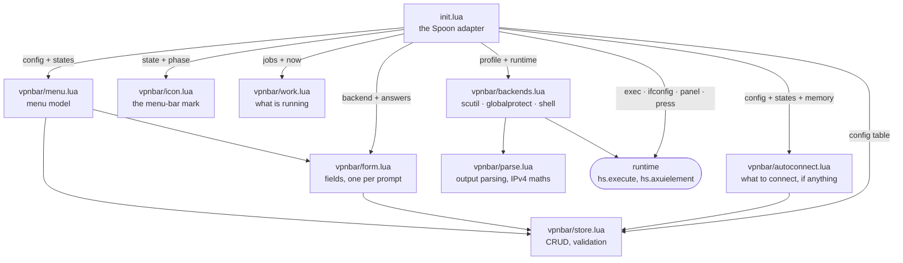

# Architecture

Eight modules decide things and one file talks to Hammerspoon.



`store`, `menu`, `parse`, `backends`, `form`, `icon`, `work` and `autoconnect`
never call Hammerspoon. `backends` is
handed a **runtime** — four functions — and asks it for everything, which is
how a test drives the real decision code with a table of canned answers. See
[ADR 0002](adr/0002-a-pure-core-and-a-thin-shell.md).

```lua
runtime.exec(command)      --> stdout, ok
runtime.ifconfig()         --> stdout                (cached per refresh)
runtime.panel(app)         --> state                 (opens a panel; on demand only)
runtime.press(app, verbs)  --> ok, err               (clicks a control in a panel)
```

## One refresh

1. The timer fires, or the menu is opened, or **Refresh now** is clicked, or the
   Mac wakes, or the Spoon has just started.
2. `obj:runtime(allowPanelReads)` is built. On the timer, `allowPanelReads` is
   false and `runtime.panel` answers `unknown` without touching anything.
3. For every profile, `backends.status`:
   - a configured `probe` reads the cached `ifconfig` and answers, or
   - the backend answers, wrapped in `pcall` so a broken profile costs one
     `unknown` and not the whole menu.
4. `obj:paint` asks `menu.indicator(states, busy)` for the one state to draw —
   anything running beats anything settled, and among settled states anything
   connected beats anything in flight beats anything known to be down.

Everything in step 3 is synchronous, so nothing waits for it: `obj:refreshSoon`
claims the busy mark, paints, and reads from a timer callback a moment later. The
menu is built from the last read rather than a fresh one, with a read queued
behind it, and a wake gets `work.WAKE_READS` — three looks over the first quarter
minute, only the last of which may start something
([ADR 0018](adr/0018-nothing-waits-for-a-read.md)).

## One click

`menu.build` returns plain data. Every clickable row carries an **action
descriptor** — `{ kind = "disconnect", id = "work" }` — and the adapter turns
each into a closure. Nothing about a menu item is a function until it reaches
`init.lua`, which is why `menu_spec.lua` can assert what a menu offers without
opening one.

`obj:dispatch` maps a descriptor kind to a handler. Handlers that change the
config go through `store`, and `store` returns a *new* config or an error: a
rejected edit cannot leave a partly-applied one behind, and the result is
written atomically or not at all.

## One edit

`form.fields(backend)` is an ordered list of what to ask; the adapter walks it
with one prompt each, prefilled from `form.defaults`. `form.build` puts the
answers back into a profile, keeps what the form never asked about, drops the
previous backend's fields, and validates before anything reaches disk. Add and
Edit are the same walk with a different starting point
([ADR 0010](adr/0010-a-profile-is-edited-field-by-field.md)).

## One autoconnect

After the states are read, `autoconnect.plan` is asked for **one** thing to
connect. It has no timers and no state: the adapter owns the memory table of
what has been tried and when, clears it when a connection comes up or the Mac
wakes, and acts on at most one answer per refresh
([ADR 0013](adr/0013-autoconnect-is-a-plan-not-a-timer.md)).

## The mark in the menu bar

`icon.elements(state, size, phase)` returns `hs.canvas` descriptors and draws
nothing; the adapter renders them once per state and caches the images. They are
template images, so the state is carried by the fill and never by a colour
([ADR 0011](adr/0011-the-menu-bar-mark-is-a-template-image.md)).

What is drawn comes from two inputs and one place. `work.lua` counts the jobs in
flight — the first read, the wake schedule, an action from the click to the state
that comes back — with a deadline so a release lost to an error cannot leave the
mark up for the session. While anything is running the mark is the busy one, and
its dot breathes over `icon.PHASES` frames so that "working" looks different from
"the same as before"
([ADR 0017](adr/0017-the-mark-says-when-it-is-working.md)).

## The accessibility path

Only `globalprotect` uses it, and only because there is nothing else
([ADR 0001](adr/0001-globalprotect-is-not-a-scutil-vpn.md)).

- `menuBarItem(app)` finds the agent's `AXExtrasMenuBar` item.
- `withPanel(app, fn)` presses it, waits up to three seconds for the panel
  window, runs `fn`, and presses the same item again to close it. The same
  click both opens and closes, which beats sending Escape and does not depend
  on what is focused.
- `findPressable(root, verbs)` walks the tree — depth-limited, so a cycle
  cannot hang Hammerspoon — for an element that has an `AXPress` action and
  whose title, description or value contains one of the verbs. The panel is
  searched first, the options popup second.

Matching on text rather than on a remembered position is what makes this
survive an agent update that moves a control, and it is why nothing here needs
to know whether Disconnect is a button on the panel or an item in the menu.
